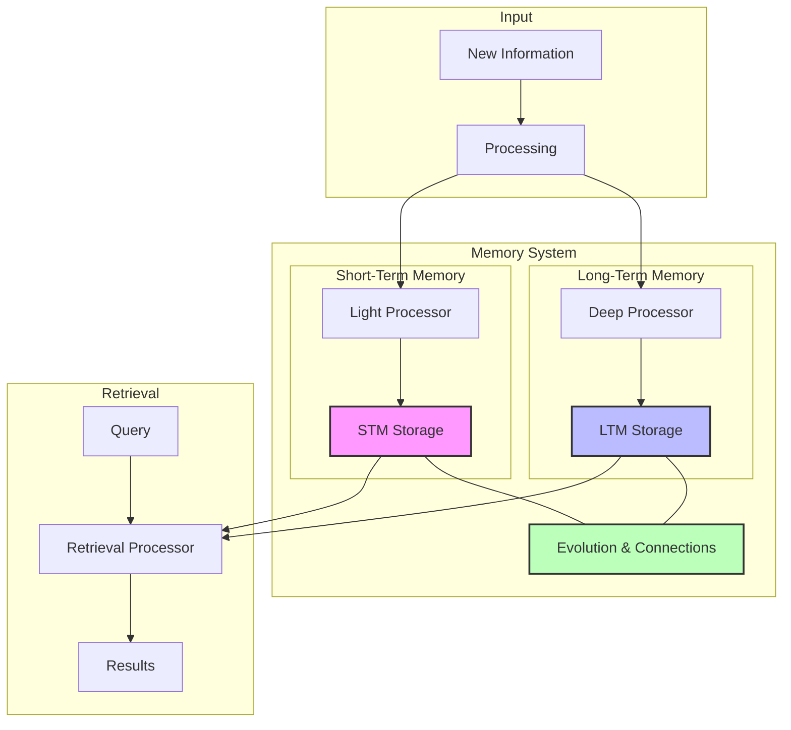
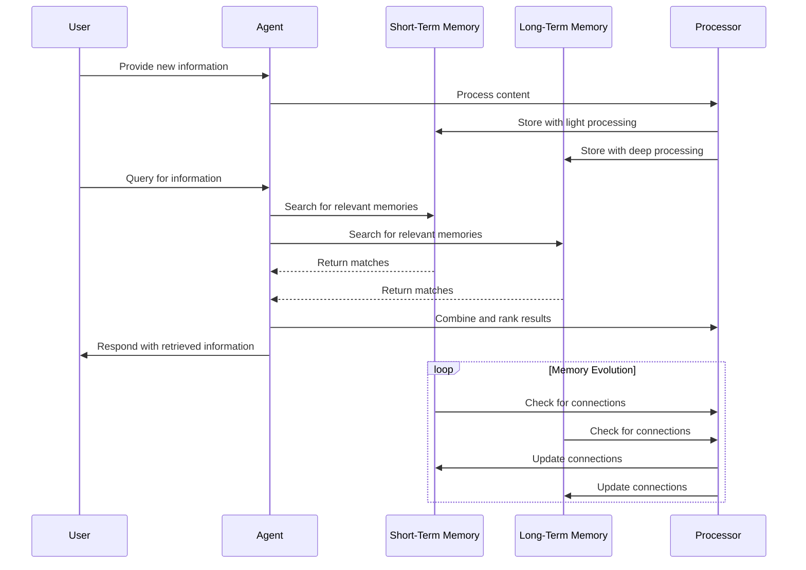
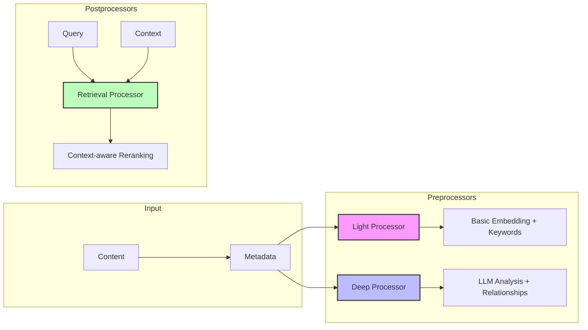
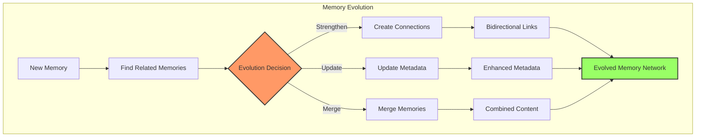

# Cortex: Advanced Memory System for AI Agents

Cortex is a sophisticated memory system designed for AI agents, enabling them to store, retrieve, and evolve information over time. It provides a cognitive architecture inspired by human memory, with distinct short-term and long-term memory systems working together to create a rich, interconnected knowledge base.

## 🧠 Key Features

- **Multi-tier Memory Architecture**: Short-term memory (STM) for recent information and long-term memory (LTM) for persistent storage
- **Smart Retrieval**: Context-aware semantic search using embeddings
- **Memory Evolution**: Automatically establish connections between related memories
- **Self-organizing Knowledge**: Memories evolve, merge, and develop relationships over time
- **Multi-user Support**: Segregate memories by user and session
- **Fast Processing**: Lightweight preprocessing for STM, deep processing for LTM
- **Flexible Integration**: Easy to integrate with various LLM backends

## 🏗️ Architecture Overview

Cortex implements a cognitive architecture based on how human memory works. Here's a high-level overview:



### 🔄 Memory Flow Process



## 📦 Components

### Memory Tiers

#### Short-Term Memory (STM)
A fast, in-memory storage system for recent information with:
- Limited capacity (configurable)
- Quick access and lightweight processing
- LRU (Least Recently Used) eviction policy

#### Long-Term Memory (LTM)
A persistent storage system using ChromaDB with:
- Unlimited capacity
- Deep semantic processing
- Rich relationship metadata
- Vector-based semantic search

### Memory Notes

Each memory is stored as a `MemoryNote` containing:
- Core content
- Metadata (context, keywords, tags)
- Temporal information (creation and access timestamps)
- Relationship links to other memories
- Evolution history

### Processors



#### Light Preprocessor
Quick processing for STM with fast embedding generation and basic keyword extraction.

#### Deep Preprocessor
Thorough processing for LTM using an LLM to extract:
- Keywords and key concepts
- Contextual information
- Categorical tags

#### Retrieval Processor
Post-processes search results for better relevance:
- Context-aware reranking
- Score adjustment based on context matching
- Link resolution and exploration

### Evolution System



The evolution system:
- Analyzes relationships between memories
- Establishes typed, weighted connections
- Merges related or complementary memories
- Updates metadata based on new insights
- Creates a self-organizing knowledge network

## 🚀 Getting Started

### Installation

```bash
git clone https://github.com/biswaroop1547/cortex.git
cd cortex

poetry install
```

### Basic Usage

Cortex has two primary operations: **storing memories** and **retrieving memories**. Here's how to use them:

#### 1. Storing Memories

```python
from cortex.memory_system import AgenticMemorySystem

# Initialize the memory system
memory_system = AgenticMemorySystem(
    model_name='all-MiniLM-L6-v2',  # Embedding model
    llm_backend="openai",           # LLM provider
    llm_model="gpt-4o-mini",        # LLM model
    stm_capacity=100                # STM capacity
)

# Method 1: Add a memory with manual metadata
memory_id = memory_system.add_note(
    content="The sky is blue because of Rayleigh scattering of sunlight.",
    context="Science",
    tags=["physics", "optics", "atmosphere"]
)

# Method 2: Add a memory with auto-generated metadata
content = "Neural networks are computational systems inspired by the human brain, consisting of nodes (neurons) connected by weighted edges."
# Auto-analyze the content to extract metadata
metadata = memory_system.analyze_content(content)

# Store with auto-generated metadata
memory_id = memory_system.add_note(
    content=content,
    # Metadata is automatically included:
    # - keywords from metadata.get("keywords")
    # - context from metadata.get("context")
)

# Store memory for a specific user/session
memory_system.add_note(
    content="User prefers dark mode for all interfaces",
    user_id="user123",
    session_id="session456"
)
```

#### 2. Retrieving Memories

```python
# Basic memory retrieval by query
results = memory_system.search_memory(
    query="How do colors appear in the sky?",
    limit=5
)

# Retrieve from specific memory source
stm_results = memory_system.search_memory(
    query="computational models",
    memory_source="stm",  # Options: "stm", "ltm", "all"
    limit=3
)

# Retrieve with context for better relevance
context_results = memory_system.search_memory(
    query="neural networks",
    context="Computer Science",  # Provides context for better matching
    limit=5
)

# Filter by tags
filtered_results = memory_system.search_memory(
    query="light scattering",
    where_filter={"tags": {"$contains": "physics"}}
)

# User-specific retrieval
user_results = memory_system.search_memory(
    query="user preferences",
    user_id="user123",
    session_id="session456"
)

for result in results:
    print(f"Content: {result['content']}")
    print(f"Score: {result['score']}")
    print(f"Memory tier: {result['memory_tier']}")
    print("---")
```

### Using the CLI

Cortex includes a command-line interface for processing text files:

```bash
python -m cortex.main --input-file data/knowledge.txt
```

You can also load pre-stored memories:

```bash
python -m cortex.main --stm-json stm_memories.json --ltm-json ltm_memories.json --skip-storage
```

## 🔧 Configuration

Cortex can be configured in several ways:

```python
memory_system = AgenticMemorySystem(
    model_name='all-MiniLM-L6-v2',  # Embedding model
    llm_backend="openai",           # LLM provider (openai/ollama/etc)
    llm_model="gpt-4o-mini",        # LLM model name
    evo_threshold=100,              # Number of memories before evolution check
    stm_capacity=100,               # STM capacity
    api_key=None                    # API key for LLM service
)
```

### Text Chunking Parameters

When processing large text files:

```python
CHUNK_SIZE = 5000      # Characters per chunk
CHUNK_OVERLAP = 200    # Overlap between chunks
```

## 🔍 Advanced Usage

### Multi-user Support

```python
# Add memory for specific user/session
memory_system.add_note(
    content="User preference: dark mode",
    user_id="user123",
    session_id="session456"
)

# Search within user context
results = memory_system.search_memory(
    query="user preferences",
    user_id="user123"
)
```

### Filter-based Search

```python
results = memory_system.search_memory(
    query="quantum physics",
    where_filter={"tags": {"$contains": "physics"}}
)
```

### Memory Evolution Control

```python
# Manually establish a link between memories
memory_system.update(
    "memory_id_1",
    links={
        "memory_id_2": {
            "type": "supports",
            "strength": 0.85,
            "reason": "These concepts are directly related"
        }
    }
)
```

## 🧪 Experimental Features

### Memory Consolidation

Memory consolidation runs periodically to improve the organization of memories:

```python
# Manually trigger consolidation
memory_system.consolidate_memories()
```

### Multi-modal Support

Coming soon: Support for image and audio memory types!

## 📊 Performance Considerations

For optimal performance:

- Keep STM capacity appropriate for your use case (50-200 items)
- Choose an embedding model that balances speed and quality
- For large knowledge bases, consider sharding by user/session/context
