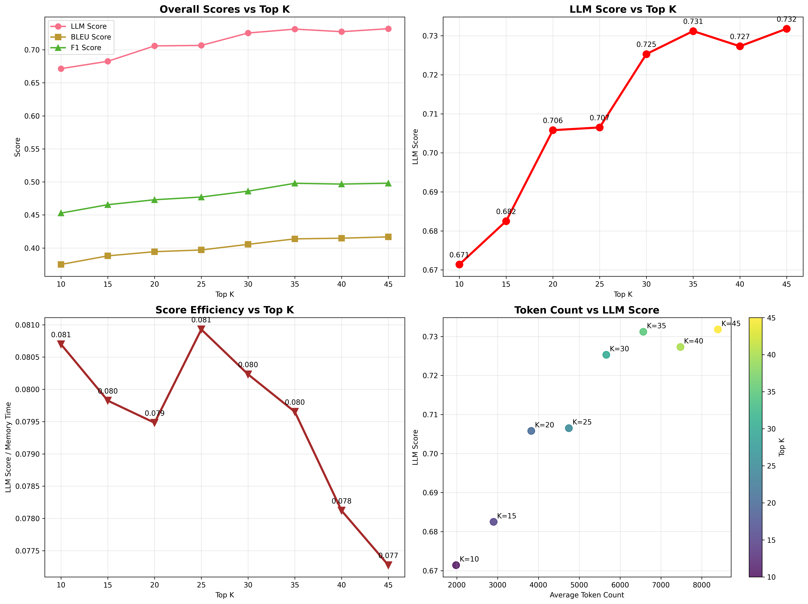

# Cortex: Advanced Memory System for AI Agents

A memory system for AI agents that stores, retrieves, and evolves information over time. Inspired by human cognitive architecture with dual-tier memory (STM/LTM) and intelligent evolution capabilities.

[](https://opensource.org/licenses/MIT)
[](https://www.python.org/downloads/)

## Table of Contents

- [Features](#features)
- [Installation](#installation)
- [Quick Start](#quick-start)
- [Usage Examples](#usage-examples)
- [Architecture](#architecture)
- [Smart Collections](#smart-collections-advanced)
- [Temporal Awareness](#temporal-awareness)
- [Configuration](#configuration)
- [Use Cases](#use-cases)
- [Benchmarks](#benchmarks)
- [Evaluation Framework](#evaluation-framework)
- [Performance](#deployment-and-performance)
- [Contributing](#contributing)
- [Citation](#citation)
- [License](#license)
- [Acknowledgments](#acknowledgments)

## Features

- **Cognitive Architecture**: Fast STM for recent info + persistent LTM with intelligent processing
- **Smart Evolution**: Memories automatically connect, merge, and develop relationships over time  
- **Smart Collections**: Context-aware categorization prevents fragmentation, grows coherent collections
- **Temporal Awareness**: Customizable recency weighting for search results
- **Hybrid Retrieval**: Combines global search + domain-aware search with intelligent query enhancement
- **Multi-User Support**: Complete isolation by user and session with shared efficiency
- **Production-Ready**: Background processing, composite scoring, enterprise-scale performance
- **Universal Integration**: Works with OpenAI, Ollama, or any LLM/embedding backend

## Installation

**Requirements**: Python 3.11+, [Poetry (for dependency management)](https://python-poetry.org/docs/#installation), 4GB+ RAM, OpenAI API key (or Ollama uri for self-hosted)

```bash
git clone https://github.com/prem-research/cortex.git
cd cortex
poetry install

# Set your API key
echo "OPENAI_API_KEY=your_key_here" > .env
```

### ChromaDB Server Setup

Cortex requires a persistent ChromaDB server for vector storage. Start it locally:

```bash
# Install ChromaDB (if not already installed)
poetry add chromadb

# Start ChromaDB server locally
poetry run chroma run --host localhost --port 8003

# Or using Docker
docker run -p 8000:8000 chromadb/chroma:latest
```

**Note**: Keep the ChromaDB server running while using Cortex. Data persists automatically across sessions.

## Quick Start

**Prerequisites**:
Start ChromaDB server first: 
```bash
poetry run chroma run --host localhost --port 8003
```

```python
from cortex.memory_system import AgenticMemorySystem
from dotenv import load_dotenv
load_dotenv(".env")

# Initialize with your OpenAI key
memory = AgenticMemorySystem(
    api_key=os.getenv("OPENAI_API_KEY"),
    enable_smart_collections=False,
)

# Store memories (auto-analyzes content for keywords, context, tags)
memory.add_note("User prefers morning meetings and uses VS Code")

# Search with context awareness
results = memory.search("What editor does the user like?")
print(results[0]['content'])  # "User prefers morning meetings and uses VS Code"

# Enable Smart Collections for mixed domains (work + personal + hobbies)
smart_memory = AgenticMemorySystem(
    api_key=os.getenv("OPENAI_API_KEY"),
    enable_smart_collections=True  # Prevents category fragmentation at scale
)
```

## Usage Examples

```python
import os
from dotenv import load_dotenv
from datetime import datetime, timedelta
from cortex.memory_system import AgenticMemorySystem

# Load environment variables
load_dotenv(".env")

try:
    # Initialize the memory system
    memory_system = AgenticMemorySystem(
        #model_name='all-MiniLM-L6-v2',  # Embedding model
        model_name='text-embedding-3-small',  # Embedding model
        llm_backend="openai",           # LLM provider
        #llm_model="gpt-4o-mini",        # LLM model
        enable_smart_collections=True,      # Knob 1: Domain organization
    enable_background_processing=True,  # Knob 2: Async vs sync
        stm_capacity=10,               # STM capacity
        api_key=os.getenv("OPENAI_API_KEY")
    )

    # Stores memories with timestamps
    # Recent memory (1 hour ago)
    memory_system.add_note(
        "User prefers TypeScript over JavaScript for new projects",
        user_id="user_123",
        time=(datetime.now() - timedelta(hours=1)).astimezone().isoformat()
    )

    # Yesterday's memory
    memory_system.add_note(
        "Discussed API rate limiting strategies using Redis",
        user_id="user_123",
        time=(datetime.now() - timedelta(days=1)).astimezone().isoformat()
    )

    # Last week's memory
    memory_system.add_note(
        "Team decided to migrate from REST to GraphQL",
        user_id="user_123",
        time=(datetime.now() - timedelta(days=7)).astimezone().isoformat()
    )

    # Specific date memory (January 2024)
    memory_system.add_note(
        "Q1 planning: Focus on performance optimization",
        user_id="user_123",
        time="2024-01-15T10:00:00+00:00"
    )

    # Retrieves with different strategies
    # Strategy 1: Pure semantic search
    results_1 = memory_system.search(
        "programming preferences",
        user_id="user_123",
        memory_source="ltm",
        limit=3,
    )
    # Returns: TypeScript preference (most semantically relevant)

    # Strategy 2: Temporal-aware search
    results_2 = memory_system.search(
        "what did we discuss yesterday?",
        user_id="user_123",
        memory_source="ltm",
        temporal_weight=0.7,  # 70% recency, 30% semantic
        limit=3,
    )
    # Returns: Redis rate limiting (from yesterday)

    # Strategy 3: Date-filtered search
    results_3 = memory_system.search(
        "team decisions",
        user_id="user_123",
        memory_source="ltm",
        date_range="last week", # RFC3339 format is preferred
        limit=3,
    )
    # Returns: GraphQL migration (within date range)

    # Strategy 4: Specific month search
    results_4 = memory_system.search(
        "planning",
        user_id="user_123",
        memory_source="ltm",
        date_range="2024-01", # from 2024-01-01 to current date (RFC3339 format is preferred)
        limit=3,
    )
    # Returns: Q1 performance optimization (January only)


except Exception as e:
    print(f"Error initializing Cortex: {e}")
    print("Please check your API key and environment setup")

def get_results(results):
    if results:
        print("Found relevant memories:")
        for result in results:
            print(f"Content: {result['content']}")
            print(f"Relevance: {result['score']:.3f}")
            # if temporal weighting was applied
            if result.get('temporal_weighted'):
                print(f"Recency: {result.get('recency_score', 'N/A'):.3f}")
            print("\n")
    else:
        print("No relevant memories found")


print("\nResults for: programming preferences (most semantically relevant)")
get_results(results_1)
print("\n---\nResults for: what did we discuss yesterday? (70% recency, 30% semantic)")
get_results(results_2)
print("\n---\nResults for: team decisions (all memories from last week)")
get_results(results_3)
print("\n---\nResults for: planning (from January 2024)")
get_results(results_4)

```

### Custom Usage Examples

#### 1. Storing Memories with Auto-analysis

```python
# Store content - add_note automatically analyzes content for rich metadata
content = "Neural networks are computational systems inspired by the human brain."

# Store with auto-generated metadata (keywords, context, tags)
memory_id = memory_system.add_note(
    content=content,
    #optionally:
    # time=timestamp, 
    # user_id=user_id, 
    # session_id=session_id,
    **metadata, # Metadata includes keywords, context, and tags
)
```

#### 2. Multi-user Memory Management

```python
# Store user-specific memories
memory_system.add_note(
    content="User prefers dark mode for all interfaces",
    user_id="user123",
    session_id="session456"
)

# Retrieve within user context
results = memory_system.search_memory(
    query="user interface preferences",
    user_id="user123",
    session_id="session456"
)
```

#### 3. Context-aware Retrieval
> Note: In most cases this will be helpful and recommended to use, as we always have some kind of context (or make some kind of context available pre-retrieval) based on the downstream task for which we are using Cortex.
> For a simple multi-turn chat usecase it can be summary of recent conversation window, or `F(recent turns summary, current turn)`.

```python
# Search with context for better relevance
results = memory_system.search_memory(
    query="machine learning models",
    context="Computer Science",
    limit=10
)

# Filter by specific criteria
filtered_results = memory_system.search_memory(
    query="optimization techniques",
    where_filter={"tags": {"$contains": "algorithms"}}
)
```


### Example: LangChain Tool Demo (Add + Search)

```python
import os
from typing import Optional, List, Dict, Any
from datetime import datetime
from pydantic import BaseModel, Field
from langchain.tools import StructuredTool
from cortex.memory_system import AgenticMemorySystem

api_key = os.getenv("OPENAI_API_KEY")
memory = AgenticMemorySystem(
    api_key=api_key,
    enable_smart_collections=bool(api_key),
    model_name="all-MiniLM-L6-v2",
    enable_background_processing=False,
)

class CortexAddNoteInput(BaseModel):
    content: str
    user_id: Optional[str] = None
    session_id: Optional[str] = None
    time: Optional[str] = Field(default=None, description="RFC3339 timestamp")
    context: Optional[str] = None
    tags: Optional[List[str]] = None
    metadata: Optional[Dict[str, Any]] = None

class CortexSearchInput(BaseModel):
    query: str
    limit: int = Field(default=10, ge=1, le=50)
    memory_source: str = Field(default="all")
    temporal_weight: float = Field(default=0.0, ge=0.0, le=1.0)
    date_range: Optional[str] = None
    where_filter: Optional[Dict[str, Any]] = None
    user_id: Optional[str] = None
    session_id: Optional[str] = None

def add_fn(content: str, user_id: Optional[str] = None, session_id: Optional[str] = None, time: Optional[str] = None, context: Optional[str] = None, tags: Optional[List[str]] = None, metadata: Optional[Dict[str, Any]] = None):
    return memory.add_note(
        content=content,
        user_id=user_id,
        session_id=session_id,
        time=time,
        context=context,
        tags=tags,
        **(metadata or {}),
    )

def search_fn(query: str, limit: int = 10, memory_source: str = "all", temporal_weight: float = 0.0, date_range: Optional[str] = None, where_filter: Optional[Dict[str, Any]] = None, user_id: Optional[str] = None, session_id: Optional[str] = None):
    return memory.search(
        query=query,
        limit=limit,
        memory_source=memory_source,
        temporal_weight=temporal_weight,
        date_range=date_range,
        where_filter=where_filter,
        user_id=user_id,
        session_id=session_id,
    )

cortex_add_note = StructuredTool.from_function(
    name="cortex_add_note",
    description="Store a memory note",
    func=add_fn,
    args_schema=CortexAddNoteInput,
)

cortex_search = StructuredTool.from_function(
    name="cortex_search",
    description="Search memories (supports temporal/date filters & metadata filters)",
    func=search_fn,
    args_schema=CortexSearchInput,
)

# Seed memory
_ = cortex_add_note.invoke({
    "content": "User prefers TypeScript over JavaScript",
    "user_id": "user_123",
    "session_id": "onboarding",
    "time": datetime.now().astimezone().isoformat(),
    "context": "preferences.programming",
    "tags": ["typescript", "language"],
    "metadata": {"source": "chat"},
})

# Demo search (matches newsletter + test script)
results = cortex_search.invoke({
    "query": "programming preferences",
    "limit": 5,
    "memory_source": "all",
    "temporal_weight": 0.2,
    "date_range": "last week",
    "where_filter": {"context": {"$eq": "preferences.programming"}},
    "user_id": "user_123",
    "session_id": "onboarding",
})
print(f"Top result: {results[0]['content'][:60]}..." if results else "No results")
```


### Using the Test CLI

Cortex includes a command-line interface for processing text files and managing memories:

```bash
# Process a text file and store memories
poetry run python -m cortex.main --input-file data/knowledge.txt

# Query existing memories
poetry run python -m cortex.main --query "What is machine learning?" --limit 5

# Load pre-stored local memories from json files
poetry run python -m cortex.main --stm-json stm_memories.json --ltm-json ltm_memories.json --skip-storage

```

#### Test CLI Parameters

| Parameter | Description | Example |
|-----------|-------------|---------|
| `--input-file` | Text file to process | `data/docs.txt` |
| `--stm-json` | Load STM from JSON | `stm_memories.json` |
| `--ltm-json` | Load LTM from JSON | `ltm_memories.json` |
| `--query` | Search query | `"user preferences"` |
| `--limit` | Max results | `10` |
| `--skip-storage` | Skip storing new memories | (flag) |

## Architecture

Cortex implements a cognitive architecture based on how human memory works. Here's a high-level overview:


### 🔄 Memory Flow Process


## 📦 Components

### Memory Tiers

#### Short-Term Memory (STM)
A fast, in-memory storage system for recent information with:
- Limited capacity (configurable)
- Quick access and lightweight processing
- LRU (Least Recently Used) eviction policy

#### Long-Term Memory (LTM)
A persistent storage system using ChromaDB with:
- Unlimited capacity
- Deep semantic processing
- Rich relationship metadata
- Vector-based semantic search

### Memory Notes

Each memory is stored as a `MemoryNote` containing:
- Core content
- Metadata (context, keywords, tags)
- Temporal information (creation and access timestamps)
- Relationship links to other memories
- Evolution history

### Memory Processors

####  Light Processor (STM)
Fast processing for immediate storage in Short-Term Memory.


####  Deep Processor (LTM)
Intelligent processing for Long-Term Memory with LLM analysis when needed.


####  Retrieval Processor (Post-Processing)
Smart reranking using **composite scoring** that combines original relevance with context similarity.

```mermaid
flowchart TD
    RP_in[Search Results + Context] --> RP_check{Results & Context<br/>Provided?}
    RP_check -->|No| RP_skip[Return Original Results]
    RP_check -->|Yes| RP_composite[Calculate Composite Scores<br/>for each result]
    
    RP_composite --> RP_formula[New Score = 0.3 × Original + 0.7 × Context Similarity<br/>Context Similarity = cosine distance between<br/>context embedding & result content embedding]
    
    RP_formula --> RP_sort[Sort by New Composite Score]
    RP_sort --> RP_out[Context-Enhanced Results]
    RP_skip --> RP_out
    
    style RP_out fill:#bfb,stroke:#333,stroke-width:2px
    style RP_formula fill:#fbf,stroke:#333,stroke-width:2px
```



### Evolution System


The evolution system:
- Analyzes relationships between memories
- Establishes typed, weighted connections
- Merges related or complementary memories
- Updates metadata based on new insights
- Creates a self-organizing knowledge network

## Smart Collections (Advanced)

Smart Collections provide domain-aware memory organization for enhanced precision and scalability.


### How It Works


1. **Context-Aware Categories**: Uses existing category patterns to ensure consistency (`work.programming.python` grows vs fragmenting)
2. **Smart Thresholds**: Creates collections when threshold is met with intelligent metadata generation
3. **Hybrid Retrieval**: All collections searched, enhanced queries where relevant, original queries elsewhere
4. **Relevance Intelligence**: LLM decides query enhancement per collection, prevents noise
5. **Composite Scoring**: Collection similarity (30%) + content relevance (70%) + global relationships

### When to Enable Smart Collections

**Enable when you have:**
- **Mixed domains**: Work + personal + hobbies creating category fragmentation
- **500+ memories**: Scale where flat search returns too many irrelevant matches  
- **Repeated patterns**: Similar content that should group together (Django, Python, meetings, etc.)

**Real Impact Example**: Query "performance optimization"
```
Without Smart Collections:
├── Django template caching (work)
├── Exercise performance tracking (personal) 
├── Database query optimization (work)
├── Car engine performance (personal)
└── Python async performance (work)
→ Mixed results, hard to find relevant work items

With Smart Collections:  
├── work.programming.python: Django + Database + Python performance
├── personal.health.fitness: Exercise tracking  
├── personal.automotive: Car performance
→ Enhanced work queries, filtered personal results
```

**Skip for:**
- **Single domain**: Only work OR only personal (no cross-domain confusion)
- **Small scale**: < 200 memories (global search works fine)  
- **Specialized use**: Focused topics like "only research papers" or "only meeting notes"

## Temporal Awareness

Cortex intelligently handles time-sensitive queries by combining semantic similarity with recency scoring to surface the most relevant recent memories.

### How It Works

**Auto-Detection**: Queries containing temporal keywords automatically trigger temporal weighting:
- `"what did I last talk about with John?"` → 70% recency + 30% semantic
- `"recent discussions about the project"` → 70% recency + 30% semantic  
- `"latest updates on the budget"` → 70% recency + 30% semantic

**Manual Control**: Fine-tune the semantic vs temporal balance:
```python
# Pure semantic search (default)
results = memory_system.search_memory("machine learning frameworks")

# Balanced approach  
results = memory_system.search_memory(
    "project updates", 
    temporal_weight=0.3  # 70% semantic + 30% recency
)

# Heavy recency focus
results = memory_system.search_memory(
    "team conversations",
    temporal_weight=0.8  # 20% semantic + 80% recency  
)
```

### Database-Level Temporal Filtering

Cortex implements efficient temporal filtering at the ChromaDB level, avoiding expensive candidate pool expansion while supporting precise date range queries.

**Date Range Support:**
```python
# Natural language date ranges
results = memory_system.search_memory(
    "conversations with team", 
    date_range="last week"
)

# Specific date formats
results = memory_system.search_memory(
    "project updates",
    date_range="2023-03"  # March 2023
)

# Combined with semantic + temporal scoring
results = memory_system.search_memory(
    "what did I discuss yesterday?",
    date_range="yesterday", 
    temporal_weight=0.5  # Blend date filtering + recency weighting
)
```

**Supported Date Formats:**
- RFC3339 (preferred): `"2023-01-01T09:00:00+00:00"` (ISO 8601/RFC3339)
- Natural: `"yesterday"`, `"last week"`, `"last month"`
- Year-Month: `"2023-03"` (March 2023)
- Year: `"2023"` (entire year)

**Performance Benefits:**
- **Database filtering**: No expensive candidate expansion (3x faster)
- **Precise ranges**: Filter by exact date windows, not just recency
- **Scalable**: Efficient even with millions of memories

### Temporal Keywords
Auto-detected keywords: `last`, `recent`, `latest`, `yesterday`, `today`, `this week`, `past`, `ago`

## Configuration

Cortex can be configured in several ways:

```python
memory_system = AgenticMemorySystem(
    model_name='all-MiniLM-L6-v2',  # Embedding model
    llm_backend="openai",          
    llm_model="gpt-4o-mini",       
    stm_capacity=100,              
    api_key=None,
)
```

## Use Cases

### Personal AI Assistants
- **Conversation Memory**: Remember user preferences, past interactions, and context
- **Learning Patterns**: Adapt to user behavior and communication style over time
- **Contextual Responses**: Provide personalized responses based on accumulated knowledge

### Customer Support Bots
- **Customer History**: Maintain comprehensive customer interaction records
- **Issue Tracking**: Remember previous issues and solutions for better support
- **Escalation Context**: Preserve context when transferring between agents

### Educational AI Tutors
- **Learning Progress**: Track student understanding and knowledge gaps
- **Personalized Curriculum**: Adapt teaching strategies based on student history
- **Concept Relationships**: Build interconnected knowledge graphs for better explanation

### Research Assistants
- **Document Memory**: Store and retrieve relevant information from research papers
- **Citation Networks**: Build relationships between related concepts and sources
- **Query Evolution**: Improve search results based on research patterns

### Content Creation Tools
- **Brand Voice**: Maintain consistent writing style and brand guidelines
- **Content History**: Reference previous content and avoid repetition
- **Audience Insights**: Remember audience preferences and engagement patterns

### Configuration Examples by Use Case

```python
# Personal Assistant (Multi-Domain)
personal_assistant = AgenticMemorySystem(
    stm_capacity=50,
    enable_smart_collections=True  # Work + personal + hobbies
)

# Enterprise Knowledge Base
enterprise_system = AgenticMemorySystem(
    stm_capacity=200,
    model_name="text-embedding-3-small",
    enable_smart_collections=True  # Multiple teams/projects
)

# Single-Domain Chatbot
chatbot_system = AgenticMemorySystem(
    stm_capacity=30,
    enable_smart_collections=False  # Focused domain, keep simple
)
```

## Memory Evolution and Consolidation

### Automatic Memory Evolution

Cortex automatically evolves memories by:
- Identifying related memories and establishing connections
- Merging complementary information
- Updating metadata based on new insights
- Creating bidirectional links between related concepts

### Manual Memory Management

```python
# Manually establish connections between memories
memory_system.update(
    "memory_id_1",
    links={
        "memory_id_2": {
            "type": "supports",
            "strength": 0.85,
            "reason": "These concepts are directly related"
        }
    }
)


```

## Benchmarks

Cortex has been extensively evaluated on the LoCoMo10 dataset, a comprehensive conversational memory benchmark that tests memory recall and understanding across various question types and complexity levels.

### Performance Summary

Cortex delivers state-of-the-art accuracy at comparable token budgets while trading higher latency for intelligence (Smart Collections + Evolved analysis).

| Method | Avg Tokens | LLM Score |
|--------|------------|-----------|
| Cortex (top-20) | ~4,000 | 0.706 |
| Cortex (top-25) | ~4,500 | 0.707 |
| Cortex (top-35) | ~7,000 | 0.731 |
| Cortex (top-45) | ~8,400 | 0.732 |
| Mem0 | 3,616 | 0.684 |
| Full-context (all turns) | ~26,000 | 0.8266 |

- At ~4k tokens (Top‑K 20), Cortex 0.706 vs Mem0 0.684 — higher accuracy at a similar token budget
- At ~4.5k tokens (Top‑K 25), Cortex 0.707 vs Mem0 0.684 — maintains lead with modest token growth
- At ~3k tokens (Top‑K 15), Cortex 0.682 vs Mem0 0.684 — near parity while using fewer tokens
- Reference upper bound: Full‑context 0.8266 (all turns). Cortex reaches 0.731 at Top‑K 35 (~7k tokens)
- Latency trade‑off: ~2s with Smart Collections disabled; ~2–8s with Smart Collections enabled

### Detailed LoCoMo10 Dataset Results

| Top-K | LLM Score | Avg Token Count |
|------:|----------:|----------------:|
| 10 | 0.671 | ~2,000 |
| 15 | 0.682 | ~3,000 |
| 20 | 0.706 | ~4,000 |
| 25 | 0.707 | ~4,500 |
| 30 | 0.725 | ~6,000 |
| 35 | 0.731 | ~7,000 |
| 40 | 0.727 | ~7,800 |
| 45 | 0.732 | ~8,400 |

### Comparison Highlights (from evaluation figures)

- Zep: 0.660 at ~3,911 tokens
- LangMem: 0.581 at 127 tokens
- A‑Mem: 0.483 at ~2,520 tokens
- OpenAI baseline: 0.529 at ~4,437 tokens
- Full‑context: 0.8266 at ~26k tokens (all turns)

### Performance Visualizations

The following visualizations demonstrate Cortex's performance characteristics across different configurations:



### Evaluation Methodology

Thanks to [mem0 evaluation scripts](https://github.com/mem0ai/mem0/tree/main/evaluation) for the evaluation framework.

Our scripts are in the [evaluation](evaluation/src/cortex/) directory.

- **Dataset**: LoCoMo10 conversational memory benchmark
- **Questions**: 1,540 evaluated questions across multiple categories (after filtering)
- **Metrics**: BLEU score, F1 score, LLM-as-a-Judge binary correctness
- **Latency**: Cortex adds internal LLM calls (collection discovery, query transformation, evolution).
  - ~2s with Smart Collections disabled
  - ~2–8s with Smart Collections enabled
- **Comparison**: Competitive or better than alternatives at similar token budgets

## Evaluation Framework

Cortex includes a comprehensive evaluation framework for testing memory system performance:

### Running Evaluations

```bash
# Process memories from dataset
python run_experiments.py --technique_type cortex --method add
python run_experiments.py --technique_type cortex --method search

# Evaluate memory retrieval
python evals.py --input_file results/cortex_results.json --output_file evaluation_metrics.json

# Generate performance scores
python generate_scores.py --mode original --file evaluation_metrics.json
```

### Metrics

The evaluation framework provides multiple metrics:
- **LLM Judge Score**: Semantic correctness evaluated by language models
- **BLEU Score**: Text similarity between retrieved and expected answers
- **F1 Score**: Precision and recall of relevant information
- **Retrieval Time**: Memory access and processing latency
- **Token Efficiency**: Context window utilization optimization

## Deployment and Performance

### Memory Persistence

Cortex automatically persists LTM data using ChromaDB. Data is stored in:
- **LTM**: ChromaDB collections
- **STM**: In-memory (lost on restart, persistent version WIP)

### Performance Tuning

For production environments:

```python
# High-performance configuration
memory_system = AgenticMemorySystem(
    stm_capacity=200,              # Increase for more recent context
    model_name='all-MiniLM-L6-v2', # Fast, efficient embedding model
    llm_model="gpt-4o-mini"        # LLM
)
```

### Scaling Considerations

- **Query Performance**: Sub-2s retrieval (without auto-collections), and Sub-8s retrieval (with auto-collections)
- **Concurrent Users**: Thread-safe operations support multiple users
- **Background Processing**: Can be disabled for high-throughput scenarios

## Contributing

We welcome contributions! Here's how to get started:

### Development Setup

1. Fork the repository
2. Create a virtual environment:
   ```bash
   python -m venv venv
   source venv/bin/activate  # On Windows: venv\Scripts\activate
   ```
3. Install development dependencies:
   ```bash
   poetry install --with dev
   ```
4. Run tests:
   ```bash
   pytest tests/
   ```

### Areas to improve

- **MultiModal Support**: Add support for multi-modal memories (text, images, audio, video)
- **New LLM Backends**: Add support for additional LLM providers
- **Embedding Models**: Integration with different embedding services
- **Memory Strategies**: New memory evolution and consolidation algorithms
- **Performance**: Optimization and caching improvements
- **Documentation**: Examples, tutorials, and use case guides

## Citation

If you use Cortex in your research or applications, please cite:

```bibtex
@software{cortex_memory_system,
  title={Cortex: Advanced Memory System for AI Agents},
  author={Bhattacharjee, Biswaroop},
  year={2025},
  url={https://github.com/prem-research/cortex}
}
```

## License

This project is licensed under the MIT License. See the [LICENSE](LICENSE) file for details.

## Acknowledgments

- [A-MEM](https://github.com/agiresearch/A-mem) for the base memory system relationship and evolution logic
- [mem0](https://github.com/mem0ai/mem0) for the evaluation scripts and benchmarks
- [LoCoMo10](https://github.com/mem0ai/mem0/tree/main/evaluation/datasets/LoCoMo10) for the dataset
- [ChromaDB](https://www.trychroma.com/) for the vector database
- [OpenAI](https://openai.com/) and [Ollama](https://ollama.ai/) for the LLM backends
