# Cortex: Advanced Memory System for AI Agents

A memory system for AI agents that stores, retrieves, and evolves information over time. Inspired by human cognitive architecture with dual-tier memory (STM/LTM) and intelligent evolution capabilities.

## Key Features

- **Cognitive Architecture**: Fast STM for recent info + persistent LTM with intelligent processing
- **Smart Evolution**: Memories automatically connect, merge, and develop relationships over time  
- **Smart Collections**: Context-aware categorization prevents fragmentation, grows coherent collections
- **Temporal Awareness**: Customizable recency weighting for search results
- **Hybrid Retrieval**: Combines global search + domain-aware search with intelligent query enhancement
- **Multi-User Support**: Complete isolation by user and session with shared efficiency
- **Production-Ready**: Background processing, composite scoring, enterprise-scale performance
- **Universal Integration**: Works with OpenAI, Ollama, or any LLM/embedding backend

##  Quick Start

**Prerequisites**: Start ChromaDB server first: `chroma run --host localhost --port 8000`

```python
from cortex.memory_system import AgenticMemorySystem

# Initialize with your OpenAI key
memory = AgenticMemorySystem(api_key="your-openai-key")

# Store memories (auto-analyzes content for keywords, context, tags)
memory.add_note("User prefers morning meetings and uses VS Code")

# Search with context awareness
results = memory.search("What editor does the user like?")
print(results[0]['content'])  # "User prefers morning meetings and uses VS Code"

# Enable Smart Collections for mixed domains (work + personal + hobbies)
smart_memory = AgenticMemorySystem(
    api_key="your-openai-key",
    enable_smart_collections=True  # Prevents category fragmentation at scale
)
```

## Architecture Overview

Cortex implements a cognitive architecture based on how human memory works. Here's a high-level overview:


### 🔄 Memory Flow Process


## 📦 Components

### Memory Tiers

#### Short-Term Memory (STM)
A fast, in-memory storage system for recent information with:
- Limited capacity (configurable)
- Quick access and lightweight processing
- LRU (Least Recently Used) eviction policy

#### Long-Term Memory (LTM)
A persistent storage system using ChromaDB with:
- Unlimited capacity
- Deep semantic processing
- Rich relationship metadata
- Vector-based semantic search

### Memory Notes

Each memory is stored as a `MemoryNote` containing:
- Core content
- Metadata (context, keywords, tags)
- Temporal information (creation and access timestamps)
- Relationship links to other memories
- Evolution history

### Memory Processors

####  Light Processor (STM)
Fast processing for immediate storage in Short-Term Memory.


####  Deep Processor (LTM)
Intelligent processing for Long-Term Memory with LLM analysis when needed.


####  Retrieval Processor (Post-Processing)
Smart reranking using **composite scoring** that combines original relevance with context similarity.

```mermaid
flowchart TD
    RP_in[Search Results + Context] --> RP_check{Results & Context<br/>Provided?}
    RP_check -->|No| RP_skip[Return Original Results]
    RP_check -->|Yes| RP_composite[Calculate Composite Scores<br/>for each result]
    
    RP_composite --> RP_formula[New Score = 0.3 × Original + 0.7 × Context Similarity<br/>Context Similarity = cosine distance between<br/>context embedding & result content embedding]
    
    RP_formula --> RP_sort[Sort by New Composite Score]
    RP_sort --> RP_out[Context-Enhanced Results]
    RP_skip --> RP_out
    
    style RP_out fill:#bfb,stroke:#333,stroke-width:2px
    style RP_formula fill:#fbf,stroke:#333,stroke-width:2px
```



### Evolution System


The evolution system:
- Analyzes relationships between memories
- Establishes typed, weighted connections
- Merges related or complementary memories
- Updates metadata based on new insights
- Creates a self-organizing knowledge network

## Smart Collections (Advanced)

Smart Collections provide domain-aware memory organization for enhanced precision and scalability.


### How It Works


1. **Context-Aware Categories**: Uses existing category patterns to ensure consistency (`work.programming.python` grows vs fragmenting)
2. **Smart Thresholds**: Creates collections when threshold is met with intelligent metadata generation
3. **Hybrid Retrieval**: All collections searched, enhanced queries where relevant, original queries elsewhere
4. **Relevance Intelligence**: LLM decides query enhancement per collection, prevents noise
5. **Composite Scoring**: Collection similarity (30%) + content relevance (70%) + global relationships

### When to Enable Smart Collections

** Enable when you have:**
- **Mixed domains**: Work + personal + hobbies creating category fragmentation
- **500+ memories**: Scale where flat search returns too many irrelevant matches  
- **Repeated patterns**: Similar content that should group together (Django, Python, meetings, etc.)

**Real Impact Example**: Query "performance optimization"
```
Without Smart Collections:
├── Django template caching (work)
├── Exercise performance tracking (personal) 
├── Database query optimization (work)
├── Car engine performance (personal)
└── Python async performance (work)
→ Mixed results, hard to find relevant work items

With Smart Collections:  
├── work.programming.python: Django + Database + Python performance
├── personal.health.fitness: Exercise tracking  
├── personal.automotive: Car performance
→ Enhanced work queries, filtered personal results
```

** Skip for:**
- **Single domain**: Only work OR only personal (no cross-domain confusion)
- **Small scale**: < 200 memories (global search works fine)  
- **Specialized use**: Focused topics like "only research papers" or "only meeting notes"

## Temporal Awareness

Cortex intelligently handles time-sensitive queries by combining semantic similarity with recency scoring to surface the most relevant recent memories.

### How It Works

**Auto-Detection**: Queries containing temporal keywords automatically trigger temporal weighting:
- `"what did I last talk about with John?"` → 70% recency + 30% semantic
- `"recent discussions about the project"` → 70% recency + 30% semantic  
- `"latest updates on the budget"` → 70% recency + 30% semantic

**Manual Control**: Fine-tune the semantic vs temporal balance:
```python
# Pure semantic search (default)
results = memory_system.search_memory("machine learning frameworks")

# Balanced approach  
results = memory_system.search_memory(
    "project updates", 
    temporal_weight=0.3  # 70% semantic + 30% recency
)

# Heavy recency focus
results = memory_system.search_memory(
    "team conversations",
    temporal_weight=0.8  # 20% semantic + 80% recency  
)
```

### Database-Level Temporal Filtering

Cortex implements efficient temporal filtering at the ChromaDB level, avoiding expensive candidate pool expansion while supporting precise date range queries.

**Date Range Support:**
```python
# Natural language date ranges
results = memory_system.search_memory(
    "conversations with team", 
    date_range="last week"
)

# Specific date formats
results = memory_system.search_memory(
    "project updates",
    date_range="2023-03"  # March 2023
)

# Combined with semantic + temporal scoring
results = memory_system.search_memory(
    "what did I discuss yesterday?",
    date_range="yesterday", 
    temporal_weight=0.5  # Blend date filtering + recency weighting
)
```

**Supported Date Formats:**
- Natural: `"yesterday"`, `"last week"`, `"last month"`
- Year-Month: `"2023-03"` (March 2023)
- Year: `"2023"` (entire year)
- RFC3339: `"2023-01-01T09:00:00+00:00"` (ISO 8601/RFC3339)

**Performance Benefits:**
- **Database filtering**: No expensive candidate expansion (3x faster)
- **Precise ranges**: Filter by exact date windows, not just recency
- **Scalable**: Efficient even with millions of memories

### Temporal Keywords
Auto-detected keywords: `last`, `recent`, `latest`, `yesterday`, `today`, `this week`, `past`, `ago`

## Use Cases

### Personal AI Assistants
- **Conversation Memory**: Remember user preferences, past interactions, and context
- **Learning Patterns**: Adapt to user behavior and communication style over time
- **Contextual Responses**: Provide personalized responses based on accumulated knowledge

### Customer Support Bots
- **Customer History**: Maintain comprehensive customer interaction records
- **Issue Tracking**: Remember previous issues and solutions for better support
- **Escalation Context**: Preserve context when transferring between agents

### Educational AI Tutors
- **Learning Progress**: Track student understanding and knowledge gaps
- **Personalized Curriculum**: Adapt teaching strategies based on student history
- **Concept Relationships**: Build interconnected knowledge graphs for better explanation

### Research Assistants
- **Document Memory**: Store and retrieve relevant information from research papers
- **Citation Networks**: Build relationships between related concepts and sources
- **Query Evolution**: Improve search results based on research patterns

### Content Creation Tools
- **Brand Voice**: Maintain consistent writing style and brand guidelines
- **Content History**: Reference previous content and avoid repetition
- **Audience Insights**: Remember audience preferences and engagement patterns

### Configuration Examples by Use Case

```python
# Personal Assistant (Multi-Domain)
personal_assistant = AgenticMemorySystem(
    stm_capacity=50,
    enable_smart_collections=True  # Work + personal + hobbies
)

# Enterprise Knowledge Base
enterprise_system = AgenticMemorySystem(
    stm_capacity=200,
    model_name="text-embedding-ada-002",
    enable_smart_collections=True  # Multiple teams/projects
)

# Single-Domain Chatbot
chatbot_system = AgenticMemorySystem(
    stm_capacity=30,
    enable_smart_collections=False  # Focused domain, keep simple
)
```

## Installation

**Requirements**: Python 3.11+, [Poetry (for dependency management)](https://python-poetry.org/docs/#installation), 4GB+ RAM, OpenAI API key (or Ollama uri for self-hosted)

```bash
git clone https://github.com/biswaroop1547/cortex.git
cd cortex
poetry install

# Set your API key
echo "OPENAI_API_KEY=your_key_here" > .env
```

### ChromaDB Server Setup

Cortex requires a persistent ChromaDB server for vector storage. Start it locally:

```bash
# Install ChromaDB (if not already installed)
pip install chromadb

# Start ChromaDB server locally
chroma run --host localhost --port 8003

# Or using Docker
docker run -p 8000:8000 chromadb/chroma:latest
```

**Note**: Keep the ChromaDB server running while using Cortex. Data persists automatically across sessions.

## Usage Examples

```python
from cortex.memory_system import AgenticMemorySystem
import os
from dotenv import load_dotenv

# Load environment variables
load_dotenv()

try:
    # Initialize the memory system
    memory_system = AgenticMemorySystem(
        model_name='all-MiniLM-L6-v2',  # Embedding model
        llm_backend="openai",           # LLM provider
        llm_model="gpt-4o-mini",        # LLM model
        stm_capacity=100,               # STM capacity
        api_key=os.getenv("OPENAI_API_KEY")
    )

    # Store a memory
    memory_id = memory_system.add_note(
        content="The user prefers morning meetings and uses VS Code for development.",
        context="User Preferences",
        tags=["scheduling", "tools"]
    )
    print(f"Stored memory with ID: {memory_id}")

    # Search for relevant memories
    results = memory_system.search_memory(
        query="What editor does the user prefer?",
        limit=5
    )

    # Temporal-aware search (auto-detects "last", "recent", "latest" keywords)
    recent_results = memory_system.search_memory(
        query="what did I last discuss with the team?",
        limit=5  # Automatically applies temporal_weight=0.7 for recency
    )
    
    # Date range filtering
    date_filtered = memory_system.search_memory(
        query="team meetings", 
        limit=5,
        date_range="last week"  # Database-level temporal filtering
    )
    
    # Manual temporal weighting (0.0=semantic only, 1.0=recency only)
    custom_temporal = memory_system.search_memory(
        query="project updates",
        limit=5,
        temporal_weight=0.3  # Blend: 70% semantic + 30% recency
    )

    if results:
        print("Found relevant memories:")
        for result in results:
            print(f"Content: {result['content']}")
            print(f"Relevance: {result['score']:.3f}")
            # Check if temporal weighting was applied
            if hasattr(result, 'temporal_weighted'):
                print(f"Recency: {result.get('recency_score', 'N/A'):.3f}")
            print("---")
    else:
        print("No relevant memories found")

except Exception as e:
    print(f"Error initializing Cortex: {e}")
    print("Please check your API key and environment setup")
```

### Custom Usage Examples

#### 1. Storing Memories with Auto-analysis

```python
# Store content - add_note automatically analyzes content for rich metadata
content = "Neural networks are computational systems inspired by the human brain."

# Store with auto-generated metadata (keywords, context, tags)
memory_id = memory_system.add_note(
    content=content,
    #optionally:
    # time=timestamp, 
    # user_id=user_id, 
    # session_id=session_id,
    **metadata, # Metadata includes keywords, context, and tags
)
```

#### 2. Multi-user Memory Management

```python
# Store user-specific memories
memory_system.add_note(
    content="User prefers dark mode for all interfaces",
    user_id="user123",
    session_id="session456"
)

# Retrieve within user context
results = memory_system.search_memory(
    query="user interface preferences",
    user_id="user123"
)
```

#### 3. Context-aware Retrieval

```python
# Search with context for better relevance
results = memory_system.search_memory(
    query="machine learning models",
    context="Computer Science",
    limit=10
)

# Filter by specific criteria
filtered_results = memory_system.search_memory(
    query="optimization techniques",
    where_filter={"tags": {"$contains": "algorithms"}}
)
```

### Using the Test CLI

Cortex includes a command-line interface for processing text files and managing memories:

```bash
# Process a text file and store memories
python -m cortex.main --input-file data/knowledge.txt

# Load pre-stored memories
python -m cortex.main --stm-json stm_memories.json --ltm-json ltm_memories.json --skip-storage

# Query existing memories
python -m cortex.main --query "What is machine learning?" --limit 5
```

#### Test CLI Parameters

| Parameter | Description | Example |
|-----------|-------------|---------|
| `--input-file` | Text file to process | `data/docs.txt` |
| `--stm-json` | Load STM from JSON | `stm_memories.json` |
| `--ltm-json` | Load LTM from JSON | `ltm_memories.json` |
| `--query` | Search query | `"user preferences"` |
| `--limit` | Max results | `10` |
| `--skip-storage` | Skip storing new memories | (flag) |

## Configuration

Cortex can be configured in several ways:

```python
memory_system = AgenticMemorySystem(
    model_name='all-MiniLM-L6-v2',  # Embedding model
    llm_backend="openai",          
    llm_model="gpt-4o-mini",       
    stm_capacity=100,              
    api_key=None,
)
```


## Memory Evolution and Consolidation

### Automatic Memory Evolution

Cortex automatically evolves memories by:
- Identifying related memories and establishing connections
- Merging complementary information
- Updating metadata based on new insights
- Creating bidirectional links between related concepts

### Manual Memory Management

```python
# Manually establish connections between memories
memory_system.update(
    "memory_id_1",
    links={
        "memory_id_2": {
            "type": "supports",
            "strength": 0.85,
            "reason": "These concepts are directly related"
        }
    }
)


```

## Evaluation Framework

Cortex includes a comprehensive evaluation framework for testing memory system performance:

### Running Evaluations

```bash
# Process memories from dataset
python run_experiments.py --technique_type cortex --method add
python run_experiments.py --technique_type cortex --method search

# Evaluate memory retrieval
python evals.py --input_file results/cortex_results.json --output_file evaluation_metrics.json

# Generate performance scores
python generate_scores.py --mode original --file evaluation_metrics.json
```

### Metrics

The evaluation framework provides multiple metrics:
- **LLM Judge Score**: Semantic correctness evaluated by language models
- **BLEU Score**: Text similarity between retrieved and expected answers
- **F1 Score**: Precision and recall of relevant information
- **Retrieval Time**: Memory access and processing latency
- **Token Efficiency**: Context window utilization optimization

## Benchmarks

Cortex has been extensively evaluated on the LoCoMo10 dataset, a comprehensive conversational memory benchmark that tests memory recall and understanding across various question types and complexity levels.

### Performance Comparison with State-of-the-Art Methods

Cortex demonstrates competitive performance against established memory systems and retrieval methods:

| Method | Memory Tokens/Chunks | Overall LLM Score |
|--------|---------------------|------------------|
| **Cortex (top-25)** | **~4,612** | **67.66%** |
| **Cortex (top-20)** | **~3,721** | **64.94%** |
| **Cortex (top-10)** | **~1,908** | **58.12%** |
| Full-context | 26,031 | 72.90% |
| Mem0δ | 3,616 | 68.44% |
| Mem0 | 1,764 | 66.88% |
| Zep | 3,911 | 65.99% |
| RAG (best config) | 256 | 60.97% |
| LangMem | 127 | 58.10% |
| OpenAI | 4,437 | 52.90% |
| A-Mem | 2,520 | 48.38% |

**Note:** The memory time is variable (taking ~2.5s) because there's a LLM call that happens for query analysis after which retrieval happens.

**Key Competitive Advantages:**
- **Balanced Performance**: Competitive accuracy with efficient token usage
- **Flexible Scaling**: Performance scales with memory retrieval count (58.12% at top-10, 64.94% at top-20, 67.66% at top-25)

### Detailed LoCoMo10 Dataset Results

| Top-K | BLEU Score | F1 Score | LLM Score | Memory Time (ms) | Token Count |
|-------|------------|----------|-----------|------------------|-------------|
| 10    | 0.3187     | 0.3833   | 0.5812    | 4,075           | 1,908       |
| 20    | 0.3606     | 0.4360   | 0.6494    | 3,942           | 3,721       |
| 25    | 0.3731     | 0.4522   | 0.6766    | 4,365           | 4,612       |

### Performance Visualizations

The following visualizations demonstrate Cortex's performance characteristics across different configurations:

<!-- 
*Figure 1: Overall performance metrics (BLEU, F1, LLM scores) showing consistent improvement with increased memory retrieval*


*Figure 2: LLM judge scores demonstrating linear scaling across different top-k values*


*Figure 3: Score efficiency (LLM Score / Memory Time) showing optimal performance balance*


*Figure 4: Token count vs LLM score correlation, color-coded by top-k values* -->


*Figure 1: Comprehensive evaluation analysis across all performance metrics*

### Evaluation Methodology

Thanks to [mem0 evaluation scripts](https://github.com/mem0ai/mem0/tree/main/evaluation) for the evaluation framework.

Our scripts are in the [evaluation](evaluation/src/cortex/) directory.

- **Dataset**: LoCoMo10 conversational memory benchmark
- **Questions**: 1,540 evaluated questions across multiple categories (after filtering)
- **Metrics**: BLEU score, F1 score, LLM-as-a-Judge binary correctness
- **Latency**: Measured p50 and p95 percentiles for search and total response time
- **Comparison**: Direct comparison with 8 state-of-the-art memory systems

## Deployment and Performance

### Memory Persistence

Cortex automatically persists LTM data using ChromaDB. Data is stored in:
- **LTM**: ChromaDB collections
- **STM**: In-memory (lost on restart, persistent version WIP)

### Performance Tuning

For production environments:

```python
# High-performance configuration
memory_system = AgenticMemorySystem(
    stm_capacity=200,              # Increase for more recent context
    model_name='all-MiniLM-L6-v2', # Fast, efficient embedding model
    llm_model="gpt-4o-mini"        # LLM
)
```

### Scaling Considerations

- **Query Performance**: Sub-2s retrieval (without auto-collections), and Sub-8s retrieval (with auto-collections)
- **Concurrent Users**: Thread-safe operations support multiple users
- **Background Processing**: Can be disabled for high-throughput scenarios


## Contributing

We welcome contributions! Here's how to get started:

### Development Setup

1. Fork the repository
2. Create a virtual environment:
   ```bash
   python -m venv venv
   source venv/bin/activate  # On Windows: venv\Scripts\activate
   ```
3. Install development dependencies:
   ```bash
   poetry install --with dev
   ```
4. Run tests:
   ```bash
   pytest tests/
   ```


### Areas to improve

- **MultiModal Support**: Add support for multi-modal memories (text, images, audio, video)
- **New LLM Backends**: Add support for additional LLM providers
- **Embedding Models**: Integration with different embedding services
- **Memory Strategies**: New memory evolution and consolidation algorithms
- **Performance**: Optimization and caching improvements
- **Documentation**: Examples, tutorials, and use case guides

## Acknowledgments

- [A-MEM](https://github.com/agiresearch/A-mem) for the base memory system relationship and evolution logic
- [mem0](https://github.com/mem0ai/mem0) for the evaluation scripts and benchmarks
- [LoCoMo10](https://github.com/mem0ai/mem0/tree/main/evaluation/datasets/LoCoMo10) for the dataset
- [ChromaDB](https://www.trychroma.com/) for the vector database
- [OpenAI](https://openai.com/) and [Ollama](https://ollama.ai/) for the LLM backends

## License

This project is licensed under the MIT License. See the [LICENSE](LICENSE) file for details.


## Citation

If you use Cortex in your research or applications, please cite:

```bibtex
@software{cortex_memory_system,
  title={Cortex: Advanced Memory System for AI Agents},
  author={Bhattacharjee, Biswaroop},
  year={2025},
  url={https://github.com/biswaroop1547/cortex}
}
```
